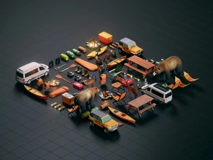
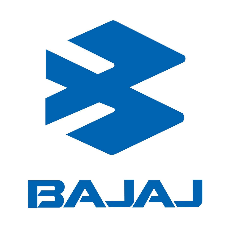
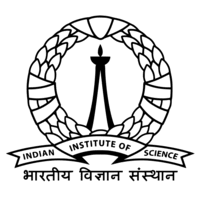

Over the span of more than 10 years in the industry, I have gained expertise in various facets of **applied Artificial Intelligence**, especially around Security and Scalablity of AI in Cloud Computing, Generative AI and Unmanned Systems.
I have been fortunate to work on some of the most cutting-edge technology in engineering, an overview of which can be found below.

## 

NVIDIA : AI Safety, Gen-AI

Jun 2023 - Present

Building state-of-the-art **Generative AI** products under [NVIDIA Picasso Edify](https://www.nvidia.com/en-us/gpu-cloud/picasso/).
Responsible for **AI Safety and Security** of the products, and a founding member of the [Red Team](https://research.ibm.com/blog/what-is-red-teaming-gen-AI) :triangular_flag_on_post: efforts to ensure safe, unbiased and **trustworthy AI**.

Deployed text-to-image, image-to-image, text-to-3d, image-to-3d AI models in partnership with [Getty Images](https://www.youtube.com/watch?v=wDle-HsJgwE) and
 led research-to-production pipeline bring-up to enable **continuous deployment** of the latest AI models and checkpoints, with a turnaround time of less than 3 hours.

I also mentor junior engineers and conduct technical interviews for new hires.

<h3>Highlights</h3>

:star: Try our generative AI offerings below :star:

| [Text to Image](https://build.nvidia.com/gettyimages/edify-image)    | [Image to 3D](https://build.nvidia.com/shutterstock/edify-3d)    | [Text to 360](https://build.nvidia.com/shutterstock/edify-360-hdri-early-access)   |
|:---:|:---:|:---:|

## 

NVIDIA : Self-Driving Cars

Oct 2018 - Jun 2023

Developed hyper scale simulation and replay capabilities for AV Verification, Validation, and iterative improvement for autonomous vehicles.
Built software that helps self-driving cars become safer by training AI to drive billions of miles in photorealistic virtual worlds. Bringup of hardware-in-the-loop simulation on [Nvidia DriveConstellation](https://techcrunch.com/2018/03/27/nvidia-debuts-new-drive-constellation-simulated-self-driving-test-system/) servers.

## 

ETH Zürich - Robotics

Sep 2018

Instructor for Robotic Architecture at [Rob-Arch 2018](https://www.robarch2018.org/clay-3d-printing-arbitrary-surfaces/) and the preparation leading up to it. 
Taught the theoretical and practical knowledge required for closed loop controlled robot 3D Printing on arbitrary surfaces, using ROS industrial, Move-it, RViz and a [custom built sensor driver package](https://github.com/codeJRV/RoboticArcitecture) for the Wenglor Laser scanner.

## 

KUKA - Cloud Intelligence

Jun 2018 - Aug 2018

Developed drivers to interface Roboception GmbH’s 3d stereo-vision camera to robot operational data stream and
provide stereo images to the AI module • Full stack cloud intelligence software development for [Kuka Connect](https://www.youtube.com/playlist?list=PLcmh-lxe_PW6ZOwDVaeaCfsOGGdD_iX33)• Developed the first Windows Linux Hybrid Kubernetes cluster using ’Top of Rack’ Routing on AWS at KUKA

## 

Texas A&M Transportation Institute - AI Research

Oct 2017 - May 2018

Conducted research with [Prof. Srikant Saripalli](https://unmanned.tamu.edu/team/) to analyse classifier performance for Traffic Sign Detection. Performed PCA and t-SNE analysis to study in-class variation of traffic signs installed across the state of Texas.
Developed an [ultra-high-speed sign detection & classification framework](https://github.com/codeJRV/HighSpeedTracking) for traffic signs inspired by research on kernelized correlation filters from Visual Geometry Group, University of Oxford. Current results : **350 fps**

## 

Dassault Systèmes - Simulation

Jun 2016 - Jul 2017

Worked in the R&D team of [Dassault Systèmes DELMIA](https://www.3ds.com/products/delmia) on kinematics and motion planning for industrial robots • Developed a new simulation player that is still in use today.
Achieved 4x performance improvements by optimizing multi-threaded C++ code of the simulation player

## 

Bajaj Auto - Industrial Robotics & AI

Jul 2014 - Jun 2016

Part of team of 12 at the [world's largest 3 wheeler automaker](https://en.wikipedia.org/wiki/Bajaj_Auto#cite_note-4), handling the **entire end-to-end automation** effort within Bajaj Auto's manufacturing sector. Introduced Sync-Slide robot, a collaborative robotic bolt tightening system with image processing, force feedback and
selective compliance. 

Sync Slide was featured by Universal Robotics as a [flagship project worldwide](https://www.universal-robots.com/case-stories/bajaj-auto/) and a case study in women empowerment. Also developed an in-house IOT based real-time assembly line monitoring and predictive analysis system with 1000+ data points/sec from 5000 sensors.

## 

Indian Institute of Science - Swarm Intelligence

May 2013 - Jul 2013

Working with Prof. [Debashish Ghose](https://scholar.google.co.in/citations?user=BUfKuTYAAAAJ&hl=en) I developed algorithms for Path Planning for Quadcopters to Survey Damaged Building Area. The relevance of this project has had a deeper impact on me, following the 2013 Kedarnath floods.
These algorithms enable disaster response teams to rapidly deploy a team of various autonomous quadcopters over the disaster scenario to identify and locate survivors within the first few hours of the disaster, so that rescue teams could directly 'approach' the location of the trapped survivors, without having to spend valuable time and effort searching for them.
[My work](https://www.oreilly.com/library/view/unmanned-aerial-systems/9780128202777/?_gl=1*pakr31*_ga*MTEyNDE3NDcxNS4xNzI0NTYzOTE2*_ga_092EL089CH*MTcyNDU2MzkxNi4xLjAuMTcyNDU2MzkxOS41Ny4wLjA.) lays down the foundation strategies and mathematical algorithms to achieve this end.

## 

Robotics Interest Group - Co-Founder

Oct 2011 - present

Co-Founded [Robotics Interest Group](https://nitc.ac.in/clubs-and-associations/the-robotics-interest-group-rig), the first academic undergraduate research body in National Institute of Technology - Calicut.
Led the development and integration of an indigenous 5 DOF mobile manipulator, Speech Recognition based Interactive Robot, High Voltage Transmission Line Inspection Robot and Bio-mimetic simulations.
Robotics Interest Group is presently Kerala's most advanced academic robotics group. Presently serving as the honorary member and advisor to the team.
