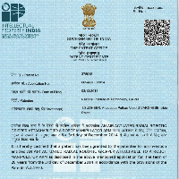
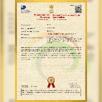
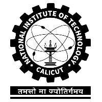

## Research Interests

AI Safety, Generative AI, Robotics, Machine Learning, Unmanned Systems, Music

## Publications

[1] Varghese, Jibin, et al. "**Disaster management using unmanned aerial vehicles**." *Unmanned Aerial Systems*. Academic Press, 2021. 129-155.

[2] Baig, Mohammed Habibullah, Jibin Rajan Varghese, and Zhangyang Wang. "**Musicmapp: a deep learning based solution for music exploration and visual interaction.**" *Proceedings of the 26th ACM international conference on Multimedia*. 2018.

<!-- [3] Varghese, Jibin Rajan, and Divya Susan Thomas. "Forecasting S&P 500 Index Closing Price using LSTM and fin BERT." (2023). -->

<!-- [4] Varghese, Jibin Rajan, and Divya Susan Thomas. "Improving Financial Sentiment Classification on ELECTRA Using Adversarial Attacks." (2023). -->

<!-- [5] Varghese, Jibin Rajan, and Divya Susan Thomas. "Survey of Generative AI in Code Generation: Privacy, Security and Ethical Considerations." (2023). -->

## Patents

A Radial Air Actuated Robotic Gripper Attachable to A Robot Manipulator Arm

Indian Patent No: 375918

Robot for High Voltage Electrical Transmission Line Inspection

Indian Patent No: 481420

## Education

Texas A&M University

Master of Computer Science

National Institute of Technology Calicut

B-Tech in Mechanical Engineering

