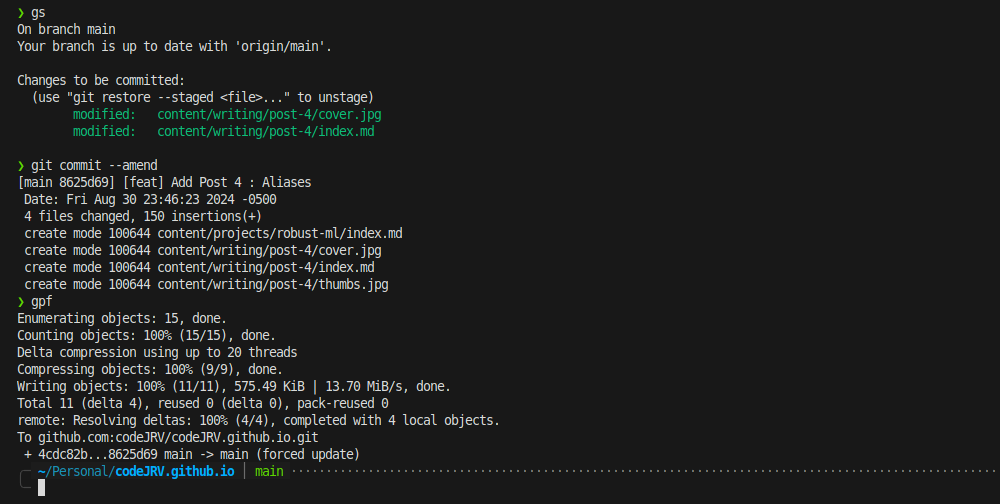

Coding is the bread and butter for many software engineers in the highly competitive tech industry. However not many developers invest sufficient time towards sharpening their programming skills once they land a tech job past their interviews. While this article might not inherently make a developer a better programmer, I am assured by my experience in the industry that the following tips will definitely help any developer become faster at their day to day job.


## Tip 1 : Master the art of Command line editing.

While some developers assume that using tools such as `emacs` or `vim` often fall into the realms of legendary code ninjas and hackers, the opposite is actually true. An average developer takes approximately 1-3 seconds to transition from the keyboard to the mouse, and roughly 1 second per click on a GUI element for purposes such as commiting and pushing code. These few seconds, while insignificant in the span of a day's work, eventually add up to over 30 minutes in a workday, or 2 and a half hours in a week, or about **150 hours** in a year. That's roughly **more than a week of extra time wasted** just transitioning between the keyboard and the mouse.

Now imagine if you could reduce this time? How do you do it?

Here are some steps.

1. Set the three fingered salute : `Ctrl + Alt + T` to pop open a terminal if your system doesn't already do so.

2. Get used to simple command line operations such as `cp`, `cd`, `ls`, `pwd`, `!`, and the `git` commands. (more on git later..)

3. Learn the habit of using `Tab` key to autocomplete file paths and directory folders and basic command line tools.

4. Learn an easy to use text editor so you can quickly hop into a file and edit it without leaving the keyboard. This might seem hard at first, but over time it get's easier. Trust me. Here's a short intro to vi with the three commands I use the most.
    - use `I` to get into editing ( insert mode)
    - use `Esc` + `:wq!` to write your changes, quit and exit
    - use `Esc` + `:q!` to quit without editing your changes.
    - You can learn more commands over time to get better at it, but the above three are good enough to get you started.

Here's a snippet from my terminal as I publish this article.




## Tip 2 : Learn Git, on the command line.

VSCode and other editors often lull you into complacency via the easy to use commit and push buttons, but the downside of using these is that you effectively become slower in making changes and often you're left completely clueless on what to do when the UI breaks for your use case.

On the other hand, learning git on the CLI enables you to work faster, by making branches on the fly, and trying out code, reverting, etc. _The key here is to become really good at failing fast, and trying out new directions faster_. I often make 10's of branches for a project locally and just delete them on the fly if my line of code does not work in the branch, effectively checkpointing my development and failing and iterating quickly. To aid with this, I often create shortcuts to use git on the terminal. Here are some of them.

```bash

alias gc="git commit"
alias gs="git status"
alias gad="git add ."
alias gamend="git commit --amend"
alias gp="git push"
alias gpf="git push -f"

alias squasher='git reset $(git merge-base main $(git rev-parse --abbrev-ref HEAD)) && git add -A && git commit'
gcmsg() {
    echo Commiting :  $1
    git add . && git commit -am $1
}

```

For those who are completely clueless and new to git, here's a series I highly reccomend watching. The video shows how prevalent and useful learning git is for anyone who uses a computer, from a software engineer to poets

[Git and Github for Poets](https://www.youtube.com/playlist?list=PLRqwX-V7Uu6ZF9C0YMKuns9sLDzK6zoiV) ( source: The Coding Train)

## Tip 3: Aliases: The secret to programming 2x faster on the terminal

Create a file called `aliases` in your `$HOME` or root directory. In your shell's `.rc` file ( eg `.bashrc`, or `.zshrc` ) add a line at the very end :  `source $HOME/aliases`.

This will ensure that every time your terminal loads, your shortcuts are loaded. Finally inside your aliases file, create shortcuts for frequently used commands.

Here are some aliases I use on a daily basis. Let's go through some of them.


```bash

# Exports
# All useful export variables go here. For example
export TEMP=$HOME/my/temp

# Shortcuts
alias aliases='code $HOME/aliases'
alias reload='source $HOME/aliases && echo Reloaded Aliases!'
alias Dls="cd $HOME/Downloads"
alias Docs="cd $HOME/Documents"
alias pgweb='docker run --network=host sosedoff/pgweb'
alias schemaspy='mkdir -p diagram/output/tables && docker run --network=host -v `pwd`/diagram:/output schemaspy/schemaspy:snapshot -t pgsql -host 0.0.0.0 -u postgres -db postgres -p pass'
alias leetcode='google-chrome https://leetcode.com/ && code $HOME/Personal/Leetcode'
alias rcp="rsync -ah --progress"
alias bashrc="code $HOME/.bashrc"
alias cleanpy="sudo find . | grep -E '(__pycache__|\.pytest_cache|\.pyc|\.pyo$)' | xargs sudo rm -rf"
alias killdoc='docker rm -f $(docker ps -q)'
alias gfmt='gofmt -w .'

killport() {
    echo Killing port $1
    lsof -ti:$1 | xargs kill
}

# Git

alias gc="git commit"
alias gs="git status"
alias gad="git add ."
alias gamend="git commit --amend"
alias gp="git push"
alias gpf="git push -f"

alias squasher='git reset $(git merge-base main $(git rev-parse --abbrev-ref HEAD)) && git add -A && git commit'
gcmsg() {
    echo Commiting :  $1
    git add . && git commit -am $1
}

# Flatten Directory
flatten() {
    find . -type f -print0 | xargs -0 -I file mv --backup=numbered file .
    find . -type d -empty -delete
    rename 's/((?:\..+)?)\.~(\d+)~$/_$2$1/' *.~*~
}

#Python
alias cleanpy="sudo find . | grep -E '(_pycache_|\.pytest_cache|\.pyc|\.pyo$)' | xargs sudo rm -rf"
alias venvs="cd $HOME/.venv/"
source $HOME/.venv/virtualenvs

create-venv() {
    if [ $# -eq 0 ]
        then
            echo "Please provide <venv-name> in order to create the virtual environment"
    fi
    if ! [[ $1 =~ ^[0-9a-zA-Z_]+$ ]]; then
        echo 'Note that only a-z, A-Z, 0-9 and underscore characters are allowed in <venv-name>' >&2 # write to stderr
        return 1
    fi
    python3 -m venv $HOME/.venv/$1
    echo Created Virtual Env :  $1
    echo "alias activate-$1=\"source $HOME/.venv/$1/bin/activate\""  | tee -a $HOME/.venv/virtualenvs >/dev/null
    source $HOME/.venv/virtualenvs
    source $HOME/.venv/$1/bin/activate
}

list-venvs() {
    cat $HOME/.venv/virtualenvs | sed -e 's/.*alias activate-\(.*\)=.*/\1/'
}

remove-venv() {
    target=$1
    read -q "REPLY?Remove virtualenv $target? (y/n):"
    echo
    if [[ $REPLY =~ ^[Yy]$ ]]
    then
    rm -rf  $HOME/.venv/$target
    sed -i "/$target/d" $HOME/.venv/virtualenvs
    echo "Virtualenv $target removed!"

```
