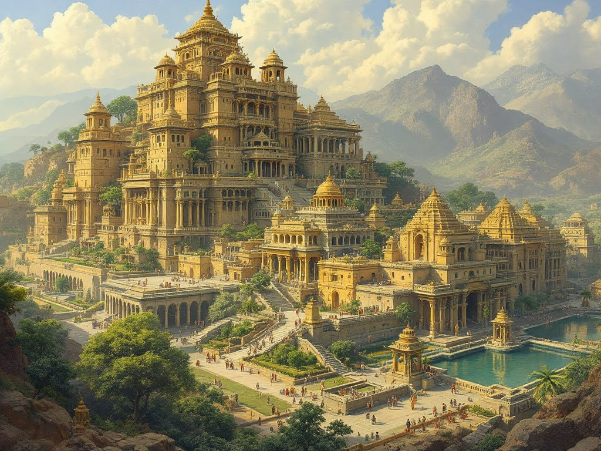

I've always been fascinated by the lost cities of antiquity and the mythical realms described in ancient texts. But it wasn't until I began experimenting with AI that I truly felt I could bring these places to life. Over the past week, I've embarked on an journey, asking state-of-the-art generative AI models to re-imagine and visualize some of history's most enigmatic urban landscapes. From the gardens of Kailash to the planned city streets of Alexandria, I've watched in awe as these models transformed my research of historic texts depicting landmarks and cities, into stunning, detailed cityscapes.

This project has not only deepened my understanding of these ancient metropolises but has also opened up new avenues for exploring the intersection of history, mythology, and technology. In this article, I'm happy to showcase some of the best resulting depictions made from historic texts and their translations that describe the glories of the ancient biblical and oriental cities, as imagined by text-to-image generative AI models.

## Kailash

Excerpt translated from description of Kailash in Brahmanda Purana

> The ancient city of Kailasa is to be alluring due to it being filled with mansions and palaces, which were spangled with numerous varieties of jewels. The yakshas of the city are stated to have assumed various forms, which were decorated with marvellous ornaments. The city boasted groves, parks, and gardens, all of which were replete with various species of trees. Enormous lakes and tanks are stated to be present in the city. The river known as Alakanandā, a branch of the Ganges, is described to surround its perimeter. Elephants, despite the fact that they experienced no thirst, consumed its waters, and turned lawny in hue. This is stated to be due to the fact that saffron is mixed into it when the apsaras bathe in it. Music is heard in the city, composed by the gandharvas as well as the apsaras

## Dwarka

Excerpt translated from Arjunabhigamana Parva of Mahabharat

> The city of dwarka had good infrastructure well constructed road system and defensible walls. None of the enemies can easily attack dwarka. The city was well equipped to fight with enemy army. The city at that time was well-fortified on all sides, according to the science (of fortification), with pennons, and arches, and combatants, and walls and turrets, and engines, and miners, and streets barricaded with spiked wood-works and towers and edifices with gate-ways well-filled with provisions, and engines for hurling burning brands and fires, and vessels, of deer-skins (for carrying water), and trumpets, tabors, and drums, lances and forks, and Sataghnis, and plough-shares, rockets, balls of stone and battle-axes and other weapons and shield embossed with iron, and engines for hurling balls and bullets and hot liquids!

## Solomon's Temple

Based on the Chapter 6 of the First Book of Kings, in the Bible

> The Temple that King Solomon built for the Lord was 90 feet long, 30 feet wide, and 45 feet high. The entry room at the   front of the Temple was 30 feet wide, running across the entire width of the Temple. It projected outward 15 feet from the front of the Temple. Solomon also made narrow recessed windows throughout the Temple.

> He built a complex of rooms against the outer walls of the Temple, all the way around the sides and rear of the building. 6The complex was three stories high, the bottom floor being 7-1/2 feet wide, the second floor 9 feet wide, and the top floor 10-1/2 feet wide. The rooms were connected to the walls of the Temple by beams resting on ledges built out from the wall. So the beams were not inserted into the walls themselves.

> The stones used in the construction of the Temple were finished at the quarry, so there was no sound of hammer, ax, or any other iron tool at the building site. The entrance to the bottom floor was on the south side of the Temple. There were winding stairs going up to the second floor, and another flight of stairs between the second and third floors. After completing the Temple structure, Solomon put in a ceiling made of cedar beams and planks. As already stated, he built a complex of rooms along the sides of the building, attached to the Temple walls by cedar timbers. Each story of the complex was 7-1/2 feet high.

## Alexandria

Excerpt from book 5 of the 2nd century novel by Achilles Tatius, _Leucippe and Clitophon_

> After a voyage lasting for three days, we arrived at Alexandria. I entered it by the Sun Gate, as it is called, and was instantly struck by the splendid beauty of the city, which filled my eyes with delight.

> From the Sun Gate to the Moon Gate — these are the guardian divinities of the entrances — led a straight double row of columns, about the middle of which lies the open part of the town, and in it so many streets that walking in them you would fancy yourself abroad while still at home. Going a few hundred yards further, I came to the quarter called after Alexander, where I saw a second town; the splendour of this was cut into squares, for there was a row of columns intersected by another as long at right angles. I tried to cast my eyes down every street, but my gaze was still unsatisfied, and I could not grasp all the beauty of the spot at once; some parts I saw, some I was on the point of seeing, some I earnestly desired to see, some I could not pass by; that which I actually saw kept my gaze fixed, while that which I expected to see would drag it on to the next.

> I explored therefore every street, and at last, my vision unsatisfied, exclaimed in weariness, “Ah, my eyes, we are beaten.” Two things struck me as especially strange and extraordinary — it was impossible to decide which was the greatest, the size of the place or its beauty, the city itself or its inhabitants ; for the former was larger than a continent, the latter outnumbered a whole nation. Looking at the city, I doubted whether any race of men could ever fill it; looking at the inhabitants, I wondered whether any city could ever be found large enough to hold them all. The balance seemed exactly even.

> It so fortuned that it was, at that time, the sacred festival of the great god whom the Greeks call Zeus, the Egyptians Serapis, and there was a procession of torches. It was the greatest spectacle I ever beheld, for it was late evening and the sun had gone down ; but there was no sign of night — it was as though another sun had arisen, but distributed into small parts in every direction; I thought that on that occasion the city vied with the sky for beauty.

(Note the reference in the excerpt above to street-lighting!)

> I also visited the Gracious Zeus and his temple in his aspect as god of Heaven; and then praying to the great god and humbly imploring him that our troubles might be at last at an end, we came back to the lodgings which Menelaus had hired for us. On the morrow came Chaereas at dawn: for very shame we could make no further excuses and got aboard a boat to go to Pharos; Menelaus stayed behind, saying that he was not well.

> Chaereas first took us to the light-house and showed us the most remarkable and extraordinary structure upon which it rested; it was like a mountain, almost reaching the clouds, in the middle of the sea. Below the building flowed the waters; it seemed to be, as it were, suspended above their surface, while at the top of this mountain rose a second sun to be a guide for ships.

