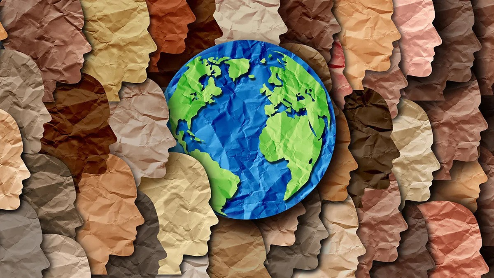

2024 was a remarkable year of progress in the Generative AI space. In the span of a few months, we have progressed from simplistic LLM's that could barely add two numbers together to thinking, reasoning models that self-introspect their responses to solve complex problems that require multiple passes of thought, even for a human. In other words, we are at the precipice of unlocking great power. Consequently with that comes the need for greater responsibility as well.

In light of this, I have asked myself the question of what are the top things that would be ideally directions to start or pursue this year, to make AI safer, fairer and more representative of all that means to be human as we head into the new year. Of late, these are the top 10 things on that list in my mind. I hope to contribute to furthering a few, if not, all of them.

## 1. Pleuralistic Alignment

In 2025, we must strive for pluralistic alignment in AI systems, ensuring they can understand and respect diverse perspectives. This approach will help create AI that is more inclusive and adaptable to various cultural contexts, leading to more universally beneficial outcomes. This abstract goal can be achieved more concretely via three possible ways:

1. **Response Variety** : Developing models that provide a spectrum of reasonable responses, instead of a single majority response
2. **Response Steerability** : i.e the ability to guide models to respond to instructions to reflect certain perspectives
3. **Distribution pleuralism** :  i.e models, that can be calibrated to respond across the whole population in the distribution.

The above three goals in turn call for benchmarking in multi-objective scenarios, steerability testing, and benchmarks that explicitly model human ratings. Finally a metric to tie it all together to give a model a pleuralistic alignment score, would be a nice way to ring in 2025!

## 2. Instruction based Guardrails

The concept of Safety in content generation varies based on the cultural values and preferences of the user. For instance, images of a surgery might by considered as gore by a layman, even though they could be valuable anatomic representations for medical practitioners. Since it is not scalable to fine-tune guardrails for every permutation and combination of user perspectives, we must adopt a system of being able to let the user choose, within reasonable limits the thresholds and preferences of safety filters applied to their content generation pipelines, based on their preferred cultural values. By 2025, the AI industry must strive to allow users this convenience, wherein before the user starts a content-generation session, they specify their level of content safety by setting a slider or a series of sliders pertaining to their choices of content-safety. Of course, local laws and national guidelines can be enforced by setting mandatory settings, similar to the "strictly necessary cookies" option shown on many popular websites.

## 3. Watermarking on-chip, at source

There is a lot of research going into invisible watermarks for "fake" of AI generated images. However, a skilled bad actor, or literally anyone with a GPU and the chops to run a stable diffusion model can generate a fake image or two without the watermarking. This means that the generated content is hard to spot as AI generated once it is disseminated via popular media. So, how can we mitigate this?

If we flip the problem on it's head, and think how can we prove which images are real, the problem becomes one of [content provenance](https://contentcredentials.org/). The default assumption here is that all images are fake ( or possibly AI-generated) unless the creators can prove otherwise. This is relatively easy considering that NFT's have been doing the exact same thing for artwork for a long time already. [C2PA](https://c2pa.org/), the Coalition for Content Provenance and Authenticity, is already making strides with the C2PA specification.

*60% of users say they would spend more money with a brand they trust to handle their personal data responsibly. ([Global Consumer State of Mind Report 2021](https://www.truata.com/resources/report/global-consumer-state-of-mind-report-2021/))*

> **Every real or authentically created content needs to have an authenticity certificate embedded in it to enable traceback to its source of creation**

This is akin to how the TLS certificates work for websites. Knowing that not everyone who snaps a photograph or records a video is not acquainted with the NFT creation process, this brings us to the crux of what we would love to see in 2025 --  an on-chip authenticity registration system. And of-course, we can overlay a default unknown / insecure symbol of content that does not have this metadata.

> Can we get this technology built right into the system-on-chip of the camera sensor?

Now imagine if every image produced by a digital device like a camera, is automatically watermarked on-chip at the sensor level with these credentials . These chips would carry their own credentials similar to how cell phones carry [IMEI numbers](https://www.imei.info/), or routers and devices on the internet have a [MAC-address](https://macaddress.io/). While this system might still have it's flaws, an an attacker with sufficient expertise in embedded electronics and silicon can forge a signature, it significantly increases the level barrier-to-entry for a novice user who wants to generate fake content that is masqueraded as real.

## 4. Integrated detectors at destination

The other side of the coin to watermarking, is ease of detection. Today, websites ubiquitously use the 🔒 icon to indicate a secure site and the 🔓 `Not Secure` notifier for websites failing to verify their TLS signatures, the same idea can be incorporated into content on these websites. This would enable users the relative ease of discerning what content is real, and what is "fake" as in ai-generated, photoshopped or otherwise modified in some way, shape or form, right at the destination closest to the viewer's eyeballs. In 2025, we should demand authenticity verification baked into all leading web-browsers, with source metadata identifiers, that can be used to discover more `about this image` or `about this video` via a simple affordance, such as a hover-over or right-click contextual menu, with an overlayed watermark for quick glances.

## 5. Being a little more uncertain, hallucinating a little less confidently

Another interesting direction of research is communicating confidence. In very simple terms, most language models today, choose the next token by basis of max probability over other candidate tokens and extending it thereon, following the system known as beam search. However, the output of these networks show only the most probable answer as **"the answer"** and not **"the most likely answer"**. In other words, most large language models do not mention their own uncertainty into the output. This is slightly different from human response, where people mention their ambiguity of knowledge of a topic, before responding to a question like the following

>    What's the temperature tomorrow?
>
>    **Human** : I'm not sure,  but I think it would be around 55-60 degrees Fahrenheit since it's winter.
>
>    **AI**  : The forecast is for overcast skies with a high of 61°F (16°C) and a low near 54°F (12°C).

Note how the human is uncertain and give an answer indicating their uncertainty, where as the LLM confidently states the values as if it knows or controls the exact weather tomorrow.

In 2025, can we make a resolution to build systems to express uncertainty into newer generation of language models, and if so, can we devise ways to help a network self-evaluate it's knowledge corpus for a metric of uncertainty? Doing so will make language models safer advisors and in-general make them give opinions and predictions explicitly, as opposed to hallucinating knowledge.

Taking this a step further, we can extrapolate this to extreme cases. For example this [lawsuit](https://www.documentcloud.org/documents/25450619-filed-complaint/) where an AI chatbot encouraged a child to kill his parents, might have benefited by being able to better communicate uncertainty over the course of it's conversation, along the lines of :

> I'm not sure if this is a good advice, since my knowlege graph only tells me what someone did under these circumstances, but I also know that this may be a felony, so perhaps seek the advice of a counsellor before following my advice...

## 6. Charting demographic axes for representative dataset building

This came out of an evening coffee chat with a non-tech friend in India. I was showing him what AI image generation looks like, and being a foodie, he asked the image generation AI for food pictures. The model spat out 4 pictures - two pizzas, a salad and a sandwitch. My friend expected samosas, dosa or any similar indian cuisine, in one of the image grids, and he tried a few times, changing the knobs and sliders on the site to see if he could get the food he was most accustomed to seeing ( or perhaps, the first idea of food, as it came to his mind). Unfortunately, this was during the early days of image generation, and the datasets back then did not have a lot of representation of [Indian food] in it's repository. This begs the larger question of model alignment with what the users expect. 

> How can we condense **what it means to be human**, and capture us, in all our diversity when it comes to teaching AI models what variety food (  or clothes, or faces, or architecture, yada yada... ) looks like? 

*Credit: iStock.com/wildpixel*

The answer to the above question comes from an uncanny source. [The Census Beaureau](https://data.census.gov/profile/United_States?g=010XX00US). For eons, census beaureaus across the world have been capturing demographic information to track trends in their representative population. Perhaps, they could be the source that gathers more than numbers ( think images, snippets, photos of faces etc) to capture representative datasets of the population, which could be appropriately tagged, and labelled to represent varied axes of the population. ( An example of this could be a nationwide survey were users can send annonymized pictures of their breakfasts, for instance). This data could then be made public for training or fine-tuning content generation models that align better to the demographics of the user base. Companies could use this dataset to finetune AI to the market(s) in which they operate.

The good news here is that there is already great work coming out in the field, for socio-demographic representation of participants from different countries, condensed into accessible datasets. An example of this is the [PRISM Alignment dataset](https://arxiv.org/abs/2404.16019), released last year. Can we imagine this being extended to add the lower rung of nations with limited access to internet, or latest tech, but unique demographic characteristics?

In 2025, with focused collaboration of government, corporations and non-profits, this *could* become yesterday's problem.

## 7. Representative Diversity over Majority

Say we did the above exercise, and built a wholly representative dataset. How do we now align the model to the data while ensuring that the majority opinion(s) or preference(s) do not overshadow the diversity? This is a tricky problem for two reasons. 

1. Techniques such as RLHF used to improve models, tend to encourage favouring picking the majority opinion

2. Artificially pushing for diversity can lead to unwanted, disastrous (or inappropriately funny) outcomes, as seen in this case with [Gemini missing the mark on racially diverse Nazis](https://www.theverge.com/2024/2/21/24079371/google-ai-gemini-generative-inaccurate-historical), especially in cases where factuality is also a factor.

How do we preserve diversity while also maintaining factuality? A novel approach spotlighted at NeurIPS 2024 might hold the key : [Diversity-Driven Synthesis](https://github.com/AngusDujw/Diversity-Driven-Synthesis) -- By employing dynamic and directed weight adjustment techniques to modulate the synthesis process, we can ensure that each batch of synthetic data mirrors the characteristics of a large, varying subset of the original dataset. This in combination with [Max-Min RLHF where we seek to learn a mixture of preference distributions](https://arxiv.org/abs/2402.08925v2) via an expectation-maximization algorithm, could hold the key to unlocking true representation in our models, and consequently our generated outputs.

Perhaps, on day in 2025, my friend would get his [dosa](https://en.wikipedia.org/wiki/Dosa_(food)) pictures on the first try in 2025 without having to learn [Prompt Engineering 101](https://www.reddit.com/r/PromptEngineering/comments/1byj8pd/prompt_engineering_101/)!

## 8. Safety by Explainability

Humans have the ability to forget unpleasant or disturbing experiences or memories, both subconsciously and intentionally. Can AI models do the same in 2025? Fortunately there is light at the end of the tunnel for this goal. State of the art research has made forays into this as early as 2023 -- seen in this paper on [Erasing Concepts from Diffusion Models](https://erasing.baulab.info/), presented at ICCV. What's next you ask? How can we do this in all modalities? Text? AutoRegression? Vision-Language? Videos? World Models? Agents? The key to understanding this problem lies at the heart of a lesser researched domain -  specifically model explainability. Once we truly understand how different architectures and models work, interpolating this to *cut out* unsafe or unwanted concepts would be relatively staightforward. In-fact we can go one step further and  build de-biased, [unified edited models](https://unified.baulab.info/) that are comprised of multiple corrections that are added on top of each other.

Furthermore, we can combine these changes in weights to be able to be applied at inference-time, thereby enabling truly [Pleuralistic Alignment](#1-pleuralistic-alignment) and [Instruction based Guardrails](#2-instruction-based-guardrails) that align closely with user preferences, diversity and settings.

## 9. Defense against poisoned arts

**Defense against the poisoned art** *(Pun intended)* becomes more relevant as content creators and large corporations jostle for control over the age-old questions of "who owns your data". While legal restrictions and public lawsuits deter blatant copyright violations, a more subtle (yet potent) way that tech-savvy artists and creators retort to is data-poisoning. This essentially means that you tweak your data at a pixel/subpixel level with minor changes that confuse and corrupt the understanding of the model, if it uses your data in it's training set.

*Source:  https://www.artstation.com/yujinchoo*

This might become more relevant in 2025 as tools such as [Nightshade](https://nightshade.cs.uchicago.edu/whatis.html) make access to data poisoning easier than ever. How does this affect model training and quality? Users looking to pre-train or finetune their vision models will have to contend with hidden sources of poisoned data, if their training corpus is unverified data from the internet. This while in-itself not being a bad thing, means that in 2025, it would be prudent to invest in developing tools that can detect data poisoning, and therefore reduce the chances of such data getting added to the training dataset of their neural networks. In the end, that's a win-win for both the intentional data poisoner, and the model trainer.

## 10. Universal AI Attack Vector Database

Lastly, let's talk about AI Security. Traditional cybersecurity frameworks such as the CVE and CVSS have regularized the handling and response of developers towards new vulnerabilities by making them more accessible and transparent in day to day software operation. The same cannot be said for AI risks. Here, the world would benefit from a similar system of risk classification, might help improve global responsiveness to AI Vulnerabilities. Thankfully some organizations such as the [AI Vulnerability Database ](https://avidml.org/) are already making first steps towards this. My hope is that in 2025, efforts like these gain mainstream adoption, or that a comprehensive standard gets built that's adopted across the industry by the end of this year.

________
*All views expressed are my own, and do not represent those of my past, current, or future employers*
